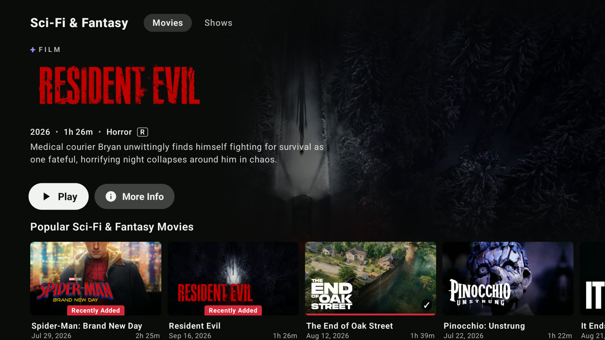
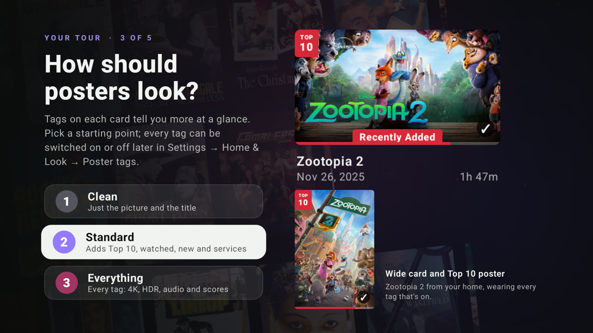

<p align="center">
  <a href="https://github.com/xeroosterpro/orca-plus/releases/latest"></a>
</p>

<p align="center">
  <a href="https://github.com/xeroosterpro/orca-plus/releases/latest"></a>
  <a href="https://github.com/xeroosterpro/orca-plus/releases"></a>
  
  <a href="LICENSE"></a>
</p>

<h3 align="center">The streaming home your Jellyfin server deserves.</h3>

<p align="center">
  Orca+ turns your media servers into a big-screen streaming service: a home that fills itself<br>
  with what's trending, every server you own in one library, and the best copy of every title,<br>
  one press away. Free and open source.
</p>

<p align="center">
  <a href="#-install"><b>Get it in 60 seconds: Downloader code <code>3075012</code></b></a>
</p>

<p align="center">
  
</p>

<br>

## ◆ Why Orca+

<table>
  <tr>
    <td width="33%" valign="top"><b>Ready the moment you sign in</b><br><sub>Trending movies and shows, the streaming Top 10s, new releases, Certified Fresh picks and a seasonal row, matched to <i>your</i> library and refreshed every day.</sub></td>
    <td width="33%" valign="top"><b>Every server, one library</b><br><sub>Add Plex, Emby and other Jellyfin servers. Press Play and Orca+ finds every copy, with the best one already picked.</sub></td>
    <td width="33%" valign="top"><b>Search like you talk</b><br><sub><i>"best sci-fi movies"</i>, <i>"movies like Interstellar"</i>, actors, typos: it understands, and searches every server.</sub></td>
  </tr>
  <tr>
    <td valign="top"><b>A page for everything</b><br><sub>8 streaming services, 10 genres and 6 decades, each with its own page, Movies and Shows side by side.</sub></td>
    <td valign="top"><b>One Continue Watching</b><br><sub>Progress from all your servers, even from other apps, in one row. Pick up anywhere.</sub></td>
    <td valign="top"><b>Set up once, every TV</b><br><sub>A guided first run, then cloud sync with a PIN: your whole setup follows you, encrypted.</sub></td>
  </tr>
  <tr>
    <td valign="top"><b>No accounts, no keys</b><br><sub>Title art, scores, search and the daily rows work out of the box. Your own keys are optional extras.</sub></td>
    <td valign="top"><b>Made for the remote</b><br><sub>Fast, smooth and built for the couch: Android TV, Google TV, NVIDIA Shield and Fire TV.</sub></td>
    <td valign="top"><b>Always current</b><br><sub>Orca+ updates itself, and picks up every improvement of the open-source Jellyfin app it's built on.</sub></td>
  </tr>
</table>

<br>

## ◆ Features

### A home that fills itself

Sign in and the home is already full. A featured billboard with **Play** and **More Info**, then
rows that are worth opening: what's trending this week, the US streaming Top 10s with their real
chart numbers, what's new on streaming, all-time greats, and a seasonal row: Halloween in October, Christmas in December.
Every row shows only titles **you actually have**, and refreshes every day. Rows follow your TV's
country for new releases and the services sold there, across 12 countries.

<table>
  <tr>
    <td width="50%"></td>
    <td width="50%"></td>
  </tr>
  <tr>
    <td align="center"><sub>Rows that fill themselves, tiles that open whole pages</sub></td>
    <td align="center"><sub>Every genre, service and decade gets its own page</sub></td>
  </tr>
</table>

Make it yours: pick, reorder and rename the rows on every page, add your own MDBList, Trakt and
Top Streaming lists, and choose how posters look. Prefer a classic side-menu home? It's one
switch away.

<br>

### Title pages that sell the movie

Clean art with the title's own logo, the year, runtime, rating and quality at a glance, review
scores, the cast, and a **More Like This** row of titles you can actually play.

<p align="center"></p>

<br>

### Every copy. One press.

Press Play and Orca+ looks for the same movie or episode on every server you've connected, then
ranks the copies: resolution first, then Dolby Vision and HDR, then bitrate. The best one is
already selected, so **OK simply plays it**. Want the smaller file for a slow connection? It's
right there.

<p align="center"></p>

<sub>Every copy shows resolution, release type, codec, HDR, audio format, channels and file size. The next episode follows the server you chose, and if a stream ever fails, playback falls back to your Jellyfin server.</sub>

<br>

### Search like you talk

Search reads what you mean, not just the letters. Typos and alternate titles are fine, actors get
their own rows, and plain requests just work:
*best sci-fi movies* · *top 10 horror movies* · *new anime* · *movies like Interstellar* · *shows like Severance*.

<p align="center"></p>

<br>

### Set up in minutes, on every TV

A short guided tour connects your Jellyfin server, adds your other servers and sets the look,
with a live preview of your own titles. Turn on **Cloud sync** with a six-digit PIN and your whole
setup (settings, rows, lists, extra servers, where you left off) follows you to any TV, encrypted
on the TV before it leaves. Keys for MDBList, Trakt or Top Streaming? Scan a QR code and paste
them on your phone: no typing with the remote.

<table>
  <tr>
    <td width="33%"></td>
    <td width="33%"></td>
    <td width="33%"></td>
  </tr>
  <tr>
    <td align="center"><sub>New, or bring your setup back</sub></td>
    <td align="center"><sub>All your servers in one place</sub></td>
    <td align="center"><sub>Choose how posters look</sub></td>
  </tr>
</table>

<br>

### One Continue Watching

Progress from your other servers, including what you watched in other apps, is merged into
**Continue Watching**, **Next Up** and **Resume**. Whatever you play from another server is
reported back to it too, so every app you use stays in step.

<br>

## ◆ Install

Works on Android TV, Google TV, NVIDIA Shield and Fire TV.

<table>
  <tr>
    <td align="center" width="260">
      <sub>DOWNLOADER CODE</sub><br>
      <b><code>3075012</code></b>
    </td>
    <td>
      1. Install <b>Downloader</b> (by AFTVnews) from your TV's app store.<br>
      2. Open it and enter <b><code>3075012</code></b>.<br>
      3. Install, open <b>Orca+</b>, and sign in to your Jellyfin server.
    </td>
  </tr>
</table>

<sub>No code? Enter this link in Downloader instead:
<code>https://github.com/xeroosterpro/orca-plus/releases/latest/download/Wholphin-release.apk</code></sub>

The link always delivers the newest version, and Orca+ offers its own updates from then on.
You need a **Jellyfin** (or Silo) server to sign in to; Plex and Emby servers can be added after.

<br>

## ◆ Updates

Orca+ updates itself. When a new version is out, **Settings → About & Help** offers
*Install update*: one press and you're current. New installs with Downloader code `3075012`
always get the newest version.

<br>

## ◆ Setup

Orca+ works out of the box. Everything else is in **Settings**, organised by what you want to do:

<p align="center"></p>

| | Where | You'll need |
|---|---|---|
| **Your home** | Home &amp; Look → Rows, Poster tags | Nothing |
| **Extra servers** | Servers &amp; Search → Extra servers → *+ Add server* | The server address. Emby/Jellyfin: username and password, or Quick Connect. Plex: a code entered at plex.tv/link. |
| **Your own lists** | Home &amp; Look → Your lists | A public MDBList or Trakt list link (Trakt also needs a free Client ID), or a Top Streaming account. |
| **Review scores** | Home &amp; Look → Poster tags → Score sources | TMDB scores work as is. IMDb, Rotten Tomatoes and more need a free MDBList key. |
| **Cloud sync** | Profile &amp; Cloud → Cloud sync | A six-digit PIN you pick. |

<br>

## ◆ FAQ

<details>
<summary><b>Which servers does it work with?</b></summary>
<br>
You sign in to a <b>Jellyfin</b> (or Silo) server; that's your main library. Plex, Emby and other
Jellyfin servers can then be added as extra servers to play from.
</details>

<details>
<summary><b>Do I need an account or a key for anything?</b></summary>
<br>
No. The home rows, title art and smart search work without any account. Cloud sync is optional,
and only needs a PIN you pick. Your own TMDB, MDBList or Trakt keys are optional extras.
</details>

<details>
<summary><b>Does it change anything on my servers?</b></summary>
<br>
Only what any player does: it reports playback progress to the server it's streaming from. Your main
Jellyfin server is never modified; progress from other servers is merged inside the app.
</details>

<details>
<summary><b>What does Orca+ send, and where?</b></summary>
<br>
Orca+ talks to your own servers, TMDB, the list sites you add, and the <b>Orca+ cloud</b>. The cloud
serves the daily home rows (the same for everyone in your country) and passes title-art and
search lookups on to TMDB, so no TMDB key is needed: those lookups carry a title's TMDB number or
your search words, nothing else. Your server addresses, account and logins never go to it. If you
turn on Cloud sync, your setup is stored there <b>encrypted with your PIN</b> on the TV first.
Passwords are used once to sign in and never stored; access tokens are encrypted with the TV's
Android Keystore.
</details>

<details>
<summary><b>Why is there no MPV player?</b></summary>
<br>
MPV and the extra software decoders come from a private package that public builds can't include.
Playback uses ExoPlayer with your TV's hardware decoders and audio passthrough, which covers normal
libraries.
</details>

<details>
<summary><b>Where do I report a problem?</b></summary>
<br>
Here, in <a href="https://github.com/xeroosterpro/orca-plus/issues">Issues</a>. Orca+ is unofficial,
so please don't report its problems to the Wholphin project.
</details>

<br>

## ◆ Under the hood

Orca+ is built on [Wholphin](https://github.com/damontecres/Wholphin), the open-source Jellyfin
client for Android TV, and keeps pace with it rather than forking away: each Wholphin release is
picked up automatically, with Orca+ on top.

- **`addon/`** holds every Orca+ feature as a separate module.
- **`hooks.patch`** is the only change to Wholphin itself: about 260 lines in 18 of its files,
  plus 4 small files of its own (settings layout, first run).
- **`build.sh`** checks out a Wholphin release, applies the patch and builds.
- **GitHub Actions** runs it automatically whenever Wholphin publishes a new version. If a Wholphin
  release reworks the code around one of the hooks, that build stops (nothing already released is
  affected) until `hooks.patch` is updated.

<details>
<summary><b>Build it yourself</b></summary>
<br>

Requires JDK 17–21 and the Android SDK.

```sh
./build.sh                                   # latest Wholphin release + Orca+
PUBLIC=1 REPO=you/wholphin-plus ./build.sh   # the shared build, as CI produces it
```
</details>

<br>

## ◆ License

Orca+ is released under the **GPL-3.0** ([LICENSE](LICENSE)). It is built on
[Wholphin](https://github.com/damontecres/Wholphin) by damontecres (GPL). See [NOTICE](NOTICE)
and [LICENSES/](LICENSES).

Every release includes its complete source code (`Orca-plus-source-….zip`): the exact Wholphin
version with the Orca+ changes applied, ready to build.

<p align="center"><sub>Unofficial · not affiliated with or endorsed by the Wholphin project<br>
Search data and images from <a href="https://www.themoviedb.org/">TMDB</a>. This product uses the TMDB API but is not endorsed or certified by TMDB.</sub></p>
