<p align="center">
  <a href="https://github.com/xeroosterpro/orca-plus/releases/latest">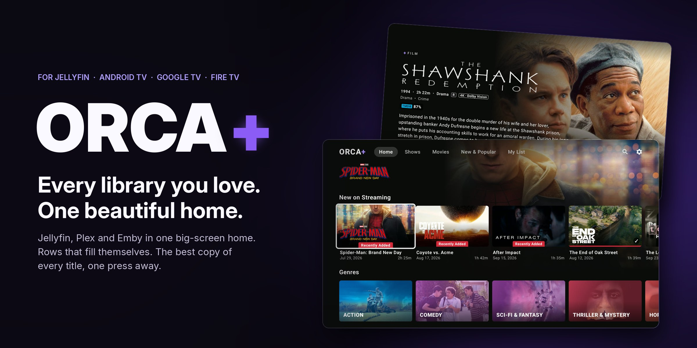</a>
</p>

<p align="center">
  <a href="https://github.com/xeroosterpro/orca-plus/releases/latest"></a>
  <a href="https://github.com/xeroosterpro/orca-plus/releases"></a>
  
  <a href="LICENSE"></a>
</p>

<h3 align="center">The streaming home your Jellyfin or Emby server deserves.</h3>

<p align="center">
  Orca+ turns your media servers into a big-screen streaming service: a home that fills itself<br>
  with what's trending, every server you own in one library, and the best copy of every title,<br>
  one press away. Free and open source.
</p>

<p align="center">
  <a href="#-install"><b>Get it in 60 seconds: Downloader code <code>3075012</code></b></a>
</p>

<p align="center">
  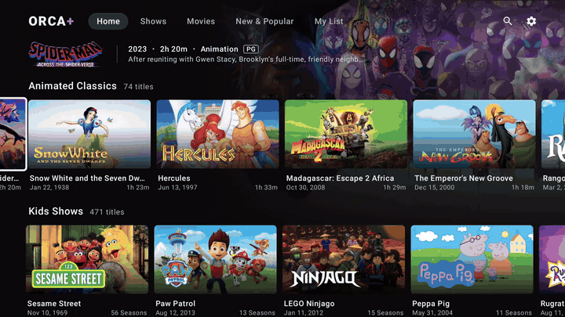
</p>

<br>

## ◆ Why Orca+

<table>
  <tr>
    <td width="33%" valign="top"><b>Ready the moment you sign in</b><br><sub>Trending movies and shows, the streaming Top 10s, new releases, Certified Fresh picks and a seasonal row, matched to <i>your</i> library and refreshed every day.</sub></td>
    <td width="33%" valign="top"><b>Smooth like the big apps</b><br><sub>Hold the remote and the rows glide. Posters load ahead of you while you rest, and the motion never waits for them.</sub></td>
    <td width="33%" valign="top"><b>Every server, one library</b><br><sub>Add Plex, Emby, Jellyfin and Silo servers. Press Play and Orca+ finds every copy, with the best one for <i>your</i> TV already picked. Browse each one in <b>My Servers</b>.</sub></td>
  </tr>
  <tr>
    <td valign="top"><b>Your account on every TV</b><br><sub>Pick an Orca+ name and a PIN. On a new TV, enter both and your servers, rows, lists and progress come back. Or set it up from your phone.</sub></td>
    <td valign="top"><b>Cast and actors</b><br><sub>Every title shows its cast. Open an actor to see their story and everything of theirs in your library.</sub></td>
    <td valign="top"><b>Tells you why</b><br><sub>If a copy won't play, Orca+ says why in plain words and offers the next best copy, with a countdown.</sub></td>
  </tr>
  <tr>
    <td valign="top"><b>Tuned to your TV</b><br><sub>Orca+ reads your box (Shield, Fire TV, Google TV) and adjusts how much it loads, and which copies it plays, to match.</sub></td>
    <td valign="top"><b>Search like you talk</b><br><sub><i>"best sci-fi movies"</i>, <i>"movies like Interstellar"</i>, actors, typos: it understands, and searches every server.</sub></td>
    <td valign="top"><b>Always current</b><br><sub>Orca+ updates itself, and picks up every improvement of the open-source Jellyfin app it's built on.</sub></td>
  </tr>
</table>

<br>

## ◆ Features

### A home that fills itself

Sign in and the home is already full. A featured billboard with **Play** and **More Info**, then
rows that are worth opening: what's trending this week, the US streaming Top 10s with their real
chart numbers, what's new on streaming, all-time greats, and a seasonal row: Halloween in October, Christmas in December.
Every row shows only titles **you actually have**, and refreshes every day. Rows follow your TV's
country for new releases and the services sold there, across 12 countries.

<table>
  <tr>
    <td width="50%">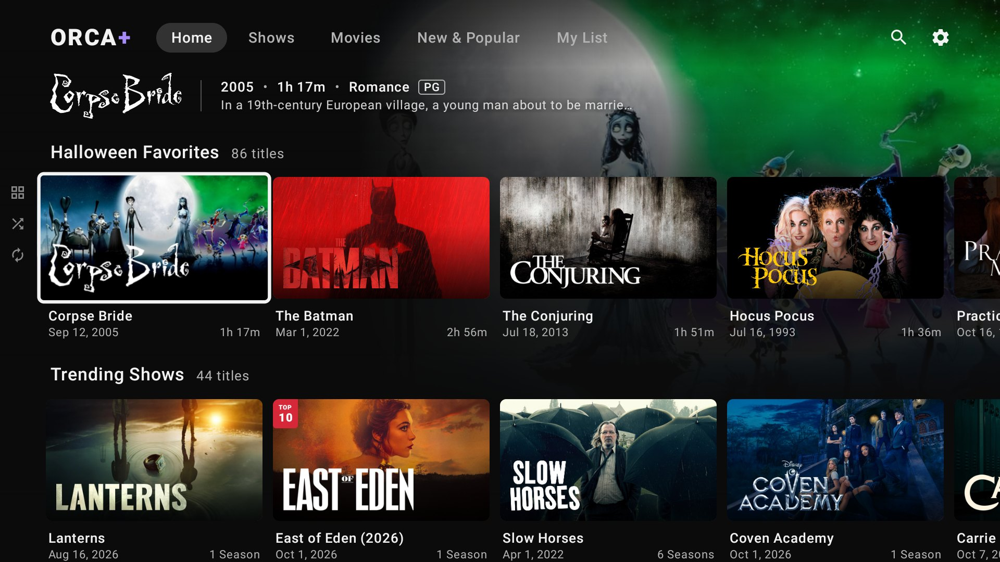</td>
    <td width="50%">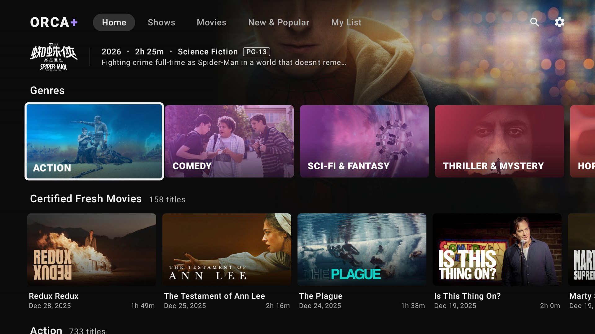</td>
  </tr>
  <tr>
    <td align="center"><sub>Rows that fill themselves, with the season</sub></td>
    <td align="center"><sub>Tiles that open a page for every genre, service and decade</sub></td>
  </tr>
</table>

Make it yours: pick, reorder and rename the rows on every page, add your own MDBList, Trakt and
Top Streaming lists, and choose how posters look. Hold OK on a Continue Watching card to remove it
or mark it watched.

<br>

### Browsing that never stutters

Orca+ is built around motion. Hold Up or Down and the page glides row after row at a steady pace;
cards appear the moment there's room for them, never in the middle of a move. While you rest or
browse slowly, posters for the rows around you load in the background, nearest first, so they're
already there when you arrive. The row you stop on loads ahead to the side.

How much it loads ahead depends on your TV: Orca+ reads the box (memory, processor, video decoders,
your screen) and picks **Full**, **Balanced** or **Light**. A Shield gets everything; a Fire TV
Stick loads more gently with the same smooth motion. You can change it in Settings → About & Help →
This TV.

<br>

### Title pages that sell the movie

Clean art with the title's own logo, the year, runtime, rating and quality at a glance, review
scores, the **cast**, and a **More Like This** row of titles you can actually play. Open an actor
for their story and everything of theirs in your library.

<p align="center">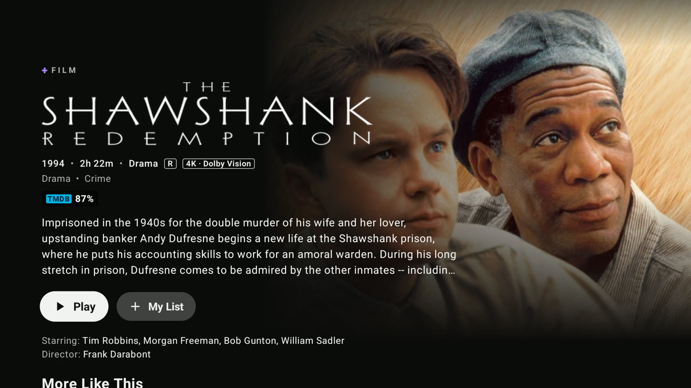</p>

<table>
  <tr>
    <td width="50%">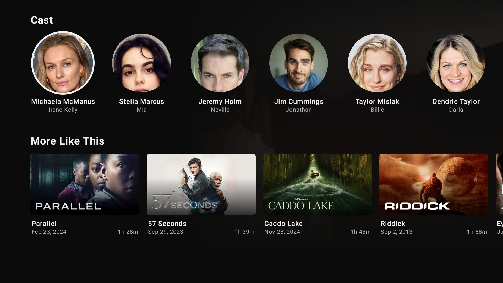</td>
    <td width="50%">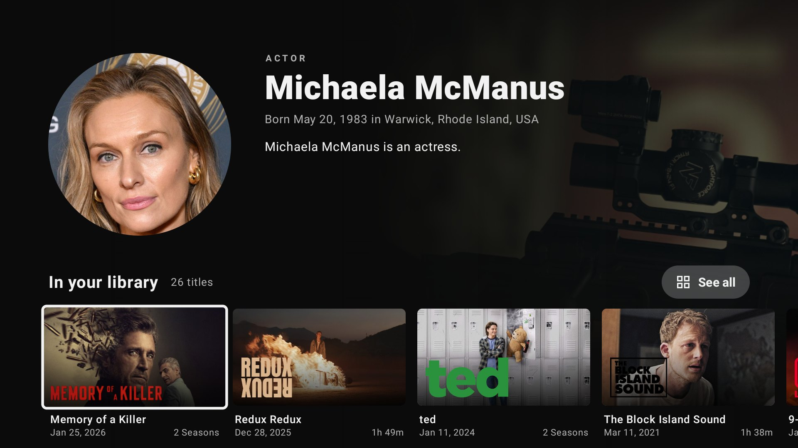</td>
  </tr>
  <tr>
    <td align="center"><sub>The cast, right under the title</sub></td>
    <td align="center"><sub>Every actor has a page</sub></td>
  </tr>
</table>

<br>

### Every copy. One press.

Press Play and Orca+ looks for the same movie or episode on every server you've connected, then
ranks the copies **for your TV**: copies your TV can decode first, then resolution and HDR as far
as your screen shows them, then size. On a 1080p TV a 1080p copy beats a 4K remux; on a 4K Dolby
Vision TV the remux wins. The best one is already selected, so **OK simply plays it**, or turn on
*Play the top copy without asking*. Copies your TV can't decode are marked.

<p align="center">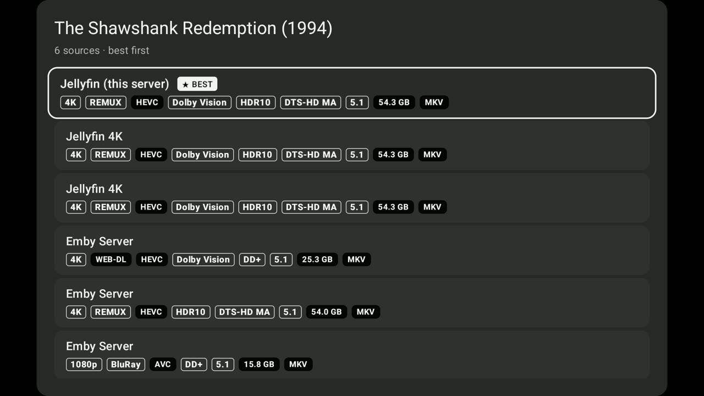</p>

<sub>Every copy shows resolution, release type, codec, HDR, audio format, channels and file size. The next episode follows the server you chose.</sub>

**When a copy won't play**, Orca+ tells you why in plain words (the server, the connection, the file
or the format) and offers the next best copy from another server, playing it by itself after a
short countdown. While a title plays, a small **Now playing** card shows the quality, HDR, audio,
server and whether it plays directly. Chapter pictures and seek previews are borrowed from any of
your servers that has them.

<br>

### Search like you talk

Search reads what you mean, not just the letters. Typos and alternate titles are fine, actors get
their own rows, and plain requests just work:
*best sci-fi movies* · *top 10 horror movies* · *new anime* · *movies like Interstellar* · *shows like Severance*.

<p align="center">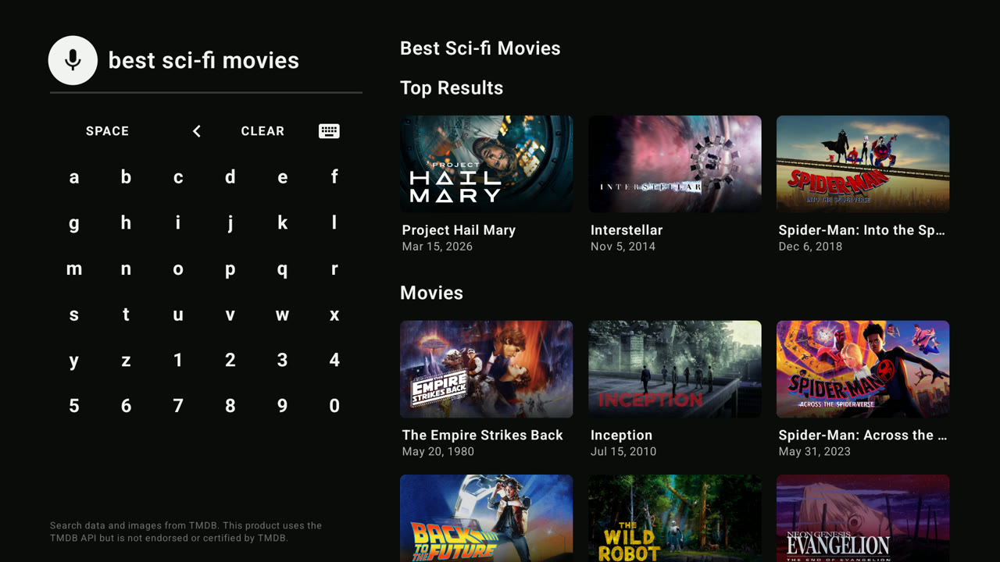</p>

<br>

### Your account, on every TV

A short guided tour connects your main server, adds your other servers and sets the look,
with a live preview of your own titles. Then **create your Orca+ account**: an Orca+ name and a
six-digit PIN. Your whole setup (settings, rows, lists, extra servers, where you left off) is saved
**encrypted with your PIN** on the TV before it leaves. On another TV, choose *I have an Orca+
account*, enter your name and PIN, and it all comes back, signed in. Rather not type with a remote?
Scan the QR code and set the TV up from your phone.

<table>
  <tr>
    <td width="33%">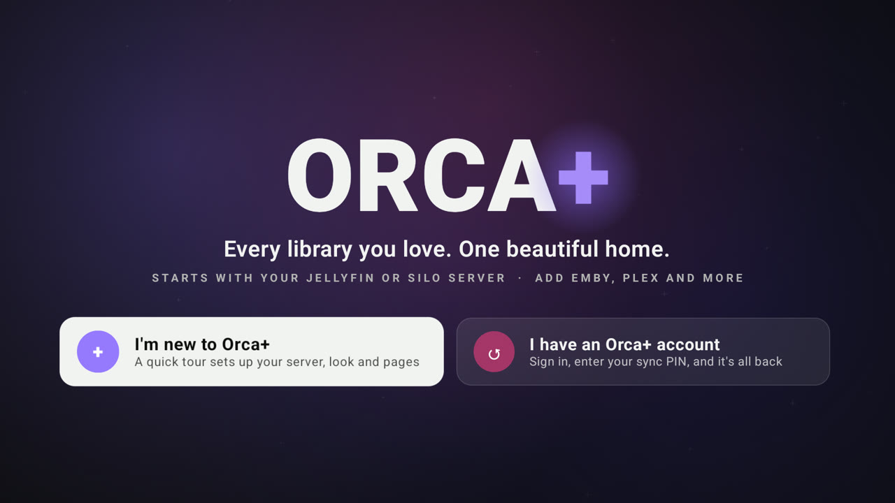</td>
    <td width="33%">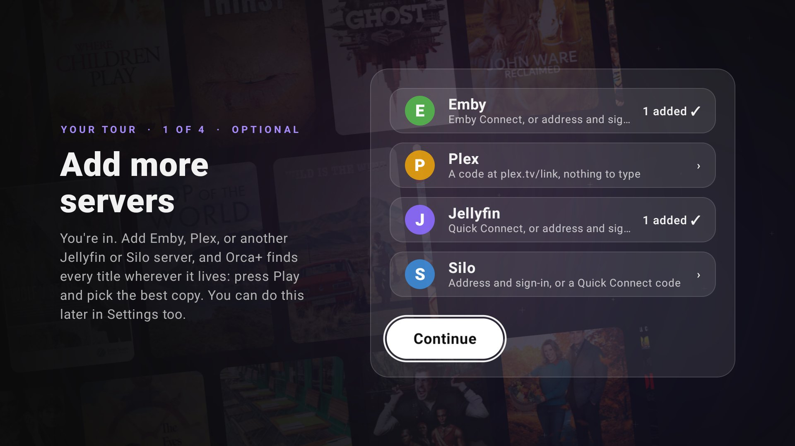</td>
    <td width="33%">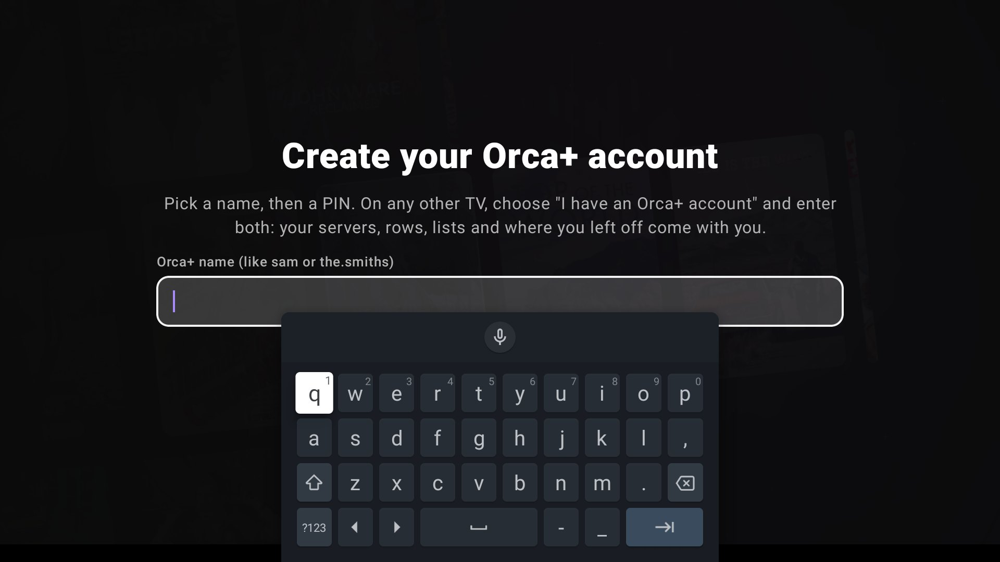</td>
  </tr>
  <tr>
    <td align="center"><sub>New, or bring your setup back</sub></td>
    <td align="center"><sub>All your servers in one place</sub></td>
    <td align="center"><sub>A name and a PIN: your account</sub></td>
  </tr>
</table>

<br>

### One Continue Watching

Progress from your other servers, including what you watched in other apps, is merged into
**Continue Watching**, **Next Up** and **Resume**. Whatever you play from another server is
reported back to it too, so every app you use stays in step.

<br>

## ◆ Install

Works on Android TV, Google TV, NVIDIA Shield and Fire TV.

<table>
  <tr>
    <td align="center" width="260">
      <sub>DOWNLOADER CODE</sub><br>
      <b><code>3075012</code></b>
    </td>
    <td>
      1. Install <b>Downloader</b> (by AFTVnews) from your TV's app store.<br>
      2. Open it and enter <b><code>3075012</code></b>.<br>
      3. Install, open <b>Orca+</b>, and sign in to your Jellyfin, Emby or Silo server.
    </td>
  </tr>
</table>

<sub>No code? Enter this link in Downloader instead:
<code>https://github.com/xeroosterpro/orca-plus/releases/latest/download/Wholphin-release.apk</code></sub>

The link always delivers the newest version, and Orca+ offers its own updates from then on.
You need a **Jellyfin**, **Emby** (new) or Silo server to sign in to; Plex and other servers can be added after.

<br>

## ◆ Updates

Orca+ updates itself. When a new version is out, **Settings → About & Help** offers
*Install update*: one press and you're current. New installs with Downloader code `3075012`
always get the newest version.

<br>

## ◆ Setup

Orca+ works out of the box. Everything else is in **Settings**, organised by what you want to do:

<p align="center">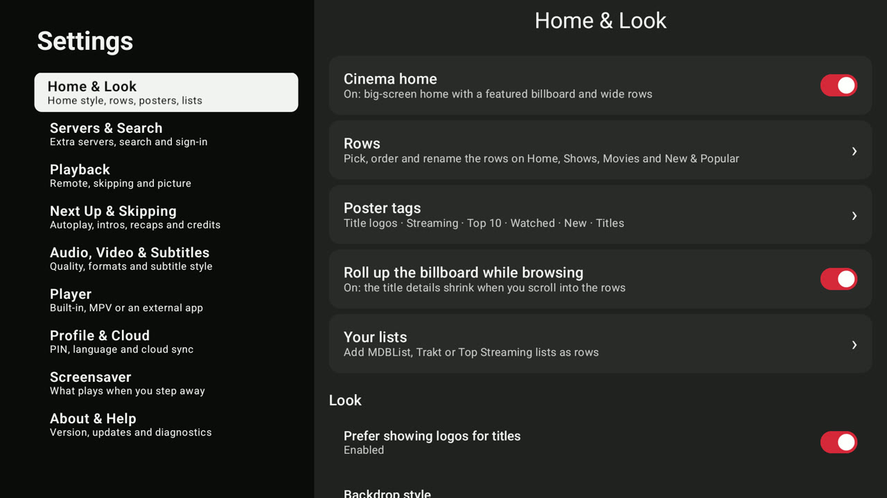</p>

| | Where | You'll need |
|---|---|---|
| **Your home** | Home &amp; Look → Rows, Poster tags, Description tags | Nothing |
| **Extra servers** | Servers &amp; Copies → Extra servers → *+ Add a server* | Your phone (scan the code and type it there), or Emby Connect, a Plex code at plex.tv/link, Jellyfin Quick Connect, or the address and sign-in. |
| **Your own lists** | Home &amp; Look → Your lists | A public MDBList or Trakt list link (Trakt also needs a free Client ID), or a Top Streaming account. |
| **Keys** | Keys &amp; Services | Optional: TMDB, MDBList (IMDb, Rotten Tomatoes and more), Trakt, Top Streaming. Add them from your phone. |
| **Your Orca+ account** | Account | An Orca+ name and a six-digit PIN you pick. |
| **This TV** | This TV | Nothing: Auto picks Full, Balanced or Light for your box. |

<br>

## ◆ FAQ

<details>
<summary><b>Which servers does it work with?</b></summary>
<br>
You sign in to a <b>Jellyfin</b>, <b>Emby</b> or Silo server; that's your main library, and it owns
your home, progress and watched marks. Plex, Emby, Jellyfin and Silo servers can then be added as
extra servers: when you press Play, Orca+ looks for the same title on them so you can pick the best
copy. <b>My Servers</b> lets you browse their libraries too (Settings → Servers &amp; Copies turns that off).
<br><br>
<b>Emby as the main server is new</b> in this release: sign-in, home, title pages, playback,
Continue Watching, My List and search all work. Emby can't be found by scanning your network yet:
type its address. Emby Connect works for extra servers.
</details>

<details>
<summary><b>Do I need an account or a key for anything?</b></summary>
<br>
No. The home rows, title art and smart search work without any account. An Orca+ account (a name
and a PIN you pick) is optional: it saves your setup so another TV can bring it back. Your own TMDB, MDBList or Trakt keys are optional extras.
</details>

<details>
<summary><b>Does it change anything on my servers?</b></summary>
<br>
Only what any player does: it reports playback progress to the server it's streaming from. Your main
server is never modified; progress from other servers is merged inside the app.
</details>

<details>
<summary><b>What does Orca+ send, and where?</b></summary>
<br>
Orca+ talks to your own servers, TMDB, the list sites you add, and the <b>Orca+ cloud</b>. The cloud
serves the daily home rows (the same for everyone in your country) and passes title-art and
search lookups on to TMDB, so no TMDB key is needed: those lookups carry a title's TMDB number or
your search words, nothing else. Your server addresses, account and logins never go to it. If you
turn on Cloud sync, your setup is stored there <b>encrypted with your PIN</b> on the TV first.
Passwords are used once to sign in and never stored; access tokens are encrypted with the TV's
Android Keystore.
</details>

<details>
<summary><b>Why is there no MPV player?</b></summary>
<br>
MPV and the extra software decoders come from a private package that public builds can't include.
Playback uses ExoPlayer with your TV's hardware decoders and audio passthrough, which covers normal
libraries.
</details>

<details>
<summary><b>Where do I report a problem?</b></summary>
<br>
Here, in <a href="https://github.com/xeroosterpro/orca-plus/issues">Issues</a>. Orca+ is unofficial,
so please don't report its problems to the Wholphin project.
</details>

<br>

## ◆ Under the hood

Orca+ is built on [Wholphin](https://github.com/damontecres/Wholphin), the open-source Jellyfin
client for Android TV, and keeps pace with it rather than forking away: each Wholphin release is
picked up, with Orca+ on top.

- **`addon/`** holds every Orca+ feature as a separate module.
- **`hooks.patch`** is the only change to Wholphin itself: small, marked hooks in 32 of its files,
  plus 3 small files of its own (settings layout, first run, log scrubbing).
- **`UPSTREAM`** pins the Wholphin release Orca+ is built on (tag and commit), so a moved tag
  can never slip into a release.
- **`build.sh`** checks out that Wholphin release, applies the patch and builds.
- **GitHub Actions** builds and publishes every change. When Wholphin publishes a new version, it
  opens an issue; the new version ships once it has been checked and `UPSTREAM` is moved to it.
  The build runs without any secrets; signing happens in a separate step, and every release lists
  the SHA-256 of its files (`SHA256SUMS`). The in-app updater installs only Orca+ signed with the
  same key as the copy you have.

<details>
<summary><b>Build it yourself</b></summary>
<br>

Requires JDK 17–21 and the Android SDK.

```sh
./build.sh                                              # the pinned Wholphin release + Orca+
PUBLIC=1 UNSIGNED=1 REPO=you/wholphin-plus ./build.sh   # the shared build, as CI produces it
```

The Orca+ cloud (Cloud sync, keys from your phone, the daily chart rows and keyless TMDB
lookups) is only in the official release. A build from this source runs without it: everything
else works, and TMDB lookups use your own key (Settings → Servers & Search). To use a cloud of
your own, pass its address as `ORCA_CLOUD_URL` or put it in a `.cloud-url` file.
</details>

<br>

## ◆ License

Orca+ is released under the **GPL-2.0** ([LICENSE](LICENSE)), the licence of
[Wholphin](https://github.com/damontecres/Wholphin) by damontecres, which it is built on. See [NOTICE](NOTICE)
and [LICENSES/](LICENSES).

Every release includes its complete source code (`Orca-plus-source-….zip`): the exact Wholphin
version with the Orca+ changes applied, ready to build.

<p align="center"><sub>Unofficial · not affiliated with or endorsed by the Wholphin project<br>
Search data and images from <a href="https://www.themoviedb.org/">TMDB</a>. This product uses the TMDB API but is not endorsed or certified by TMDB.</sub></p>
