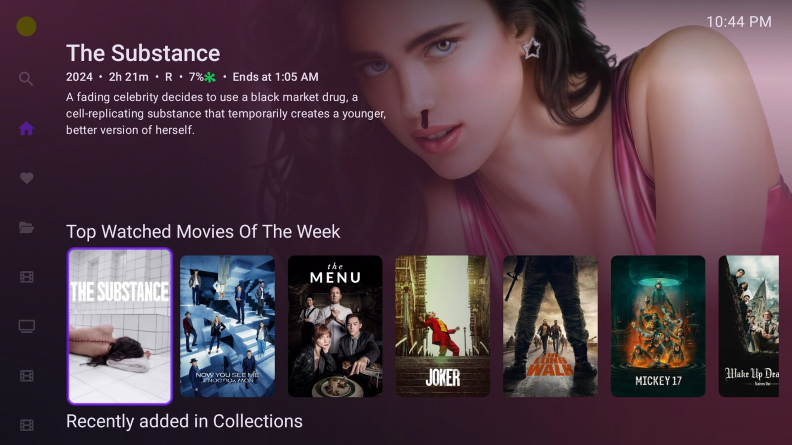
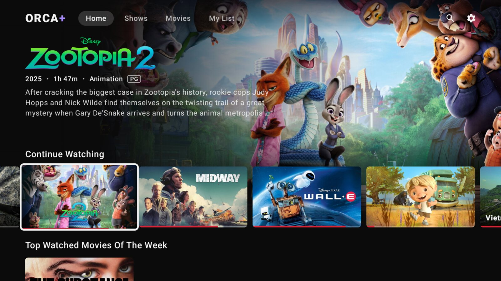
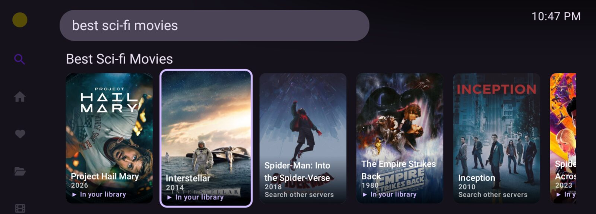
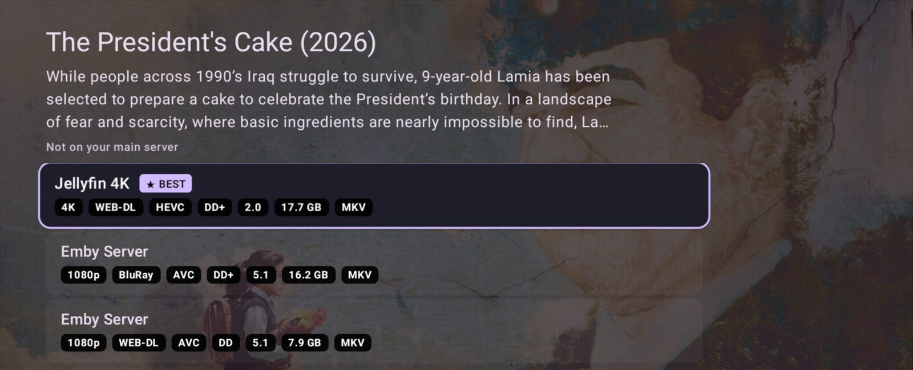
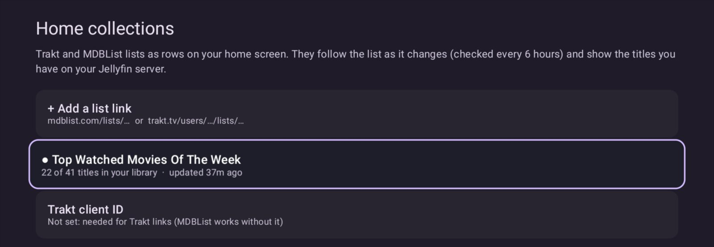

<p align="center">
  
</p>

<p align="center">
  <a href="https://github.com/xeroosterpro/orca-plus/releases/latest"></a>
  <a href="https://github.com/xeroosterpro/orca-plus/releases"></a>
  
  <a href="LICENSE"></a>
</p>

<p align="center">
  <b>Orca+</b> is an Android TV app for Jellyfin, built on <a href="https://github.com/damontecres/Wholphin">Wholphin</a> and extended to work with<br>
  all of your media servers: stream from whichever has the best copy, search intelligently,<br>
  and build your home screen from the lists you follow.
</p>

<p align="center">
  <a href="#-install"><b>Install</b> (Downloader code 3075012)</a> &nbsp;·&nbsp;
  <a href="#-updates"><b>Updates</b></a> &nbsp;·&nbsp;
  <a href="#-features"><b>Features</b></a> &nbsp;·&nbsp;
  <a href="#-setup"><b>Setup</b></a> &nbsp;·&nbsp;
  <a href="#-faq"><b>FAQ</b></a> &nbsp;·&nbsp;
  <a href="#-under-the-hood"><b>Under the hood</b></a>
</p>

<p align="center">
  
</p>

<br>

## ◆ At a glance

|  | Wholphin | **Orca+** |
|---|:---:|:---:|
| Jellyfin library, playback and home screen | ✓ | ✓ |
| Choose between copies on **Plex, Emby and other Jellyfin servers** | | ✓ |
| Continue Watching and Next Up **across every server** | | ✓ |
| **Smart search**: typos, actors, *"movies like …"*, *"best horror movies"* | | ✓ |
| Play titles that exist **only on your other servers** | | ✓ |
| **Home rows from Trakt and MDBList**, kept up to date | | ✓ |
| **Cinema mode**: a big-screen streaming home with title art, switchable any time | | ✓ |
| Installs alongside Wholphin and updates itself | | ✓ |

<br>

## ◆ Install

Works on Android TV, Google TV, NVIDIA Shield and Fire TV.

<table>
  <tr>
    <td align="center" width="260">
      <sub>DOWNLOADER CODE</sub><br>
      <b><code>3075012</code></b>
    </td>
    <td>
      1. Install <b>Downloader</b> (by AFTVnews) from your TV's app store.<br>
      2. Open it and enter <b><code>3075012</code></b>.<br>
      3. Install, open <b>Orca+</b>, and sign in to your Jellyfin server.
    </td>
  </tr>
</table>

<sub>No code? Enter this link in Downloader instead:
<code>https://github.com/xeroosterpro/orca-plus/releases/latest/download/Wholphin-release.apk</code></sub>

The link always delivers the newest version. Orca+ runs **next to** Wholphin rather than
replacing it, and offers its own updates from then on.

<br>

## ◆ Updates

Orca+ stays in step with Wholphin automatically. When Wholphin releases a new version, a new
Orca+ is built from it and published within a few hours: Wholphin's latest improvements, plus
everything Orca+ adds.

- **Already installed?** Orca+ tells you when an update is ready (*Install update* at the top of
  Settings). One click and you're current.
- **New install?** Downloader code `3075012` always gets the newest version.

<br>

## ◆ Features

### Cinema mode

Switch on **Cinema mode** (Settings → Orca+) for a streaming-style home. A featured billboard
rotates through new arrivals with **Play** and **More Info**. Below it are wide cards with title
art. As you browse, the backdrop, title logo and details of the focused title fade in at the top.
Title logos and title-art tiles come from TMDB when your server doesn't have them. Switch it off
any time for the classic home.

<p align="center"></p>

<br>

### Every copy, one choice

Press Play and Orca+ looks for the same movie or episode on every server you've connected. It
ranks the copies by resolution, then Dolby Vision/HDR, then bitrate. The best one is already
selected, so **OK simply plays it**.

<p align="center"></p>

<sub>Each copy shows resolution, release type, codec, audio format and channels, and file size. The next episode follows the server you chose, and if a stream ever fails, playback falls back to your Jellyfin server automatically.</sub>

<br>

### Search that understands you

With a free TMDB key, search reads intent rather than just matching letters. It handles typos and
alternate titles, gives actors their own rows, and takes plain requests:
*best sci-fi movies* · *top 10 horror movies* · *new anime* · *movies like Interstellar* · *shows like Severance*

<table>
  <tr>
    <td width="50%"></td>
    <td width="50%"></td>
  </tr>
  <tr>
    <td align="center"><sub>Every result shows whether it's <b>in your library</b></sub></td>
    <td align="center"><sub>Describe what you want; get a row of it</sub></td>
  </tr>
</table>

<br>

### Beyond your main server

A title that only exists on your other servers is still one click away. Open it from search and
Orca+ finds every copy (choose the season and episode for shows) and plays it in place.

<p align="center"></p>

<br>

### One Continue Watching

Progress from your other servers, including what you watched in other apps, is merged into
**Continue Watching**, **Next Up** and **Resume**. Whatever you play from another server is reported
back to it too, so every app you use stays in step.

<p align="center"></p>

<br>

### Home rows from Trakt and MDBList

Paste a list link and it becomes a row on your home screen: your titles, in the list's order.
Lists are re-checked every few hours, so **when the list changes, the row follows**.

<table>
  <tr>
    <td width="50%"></td>
    <td width="50%"></td>
  </tr>
  <tr>
    <td align="center"><sub>Add, hide, reorder, rename or refresh lists</sub></td>
    <td align="center"><sub>Everything lives under <b>Settings → Orca+</b></sub></td>
  </tr>
</table>

<br>

## ◆ Setup

Everything is under **Settings → Orca+**, the first row of Settings (press Up).

| | Where | You'll need |
|---|---|---|
| **Extra servers** | Extra sources → *+ Add server* | The server address. Emby/Jellyfin: username and password, or Quick Connect. Plex: a code entered at plex.tv/link. |
| **Smart search** | Search | A free [TMDB API key](https://www.themoviedb.org/settings/api). Without one, the standard search is used. |
| **Home rows** | Home collections → *+ Add a list link* | A public MDBList or Trakt list link. Trakt also needs a free Client ID (trakt.tv → Settings → Your API Apps). |

<br>

## ◆ FAQ

<details>
<summary><b>Does it replace Wholphin?</b></summary>
<br>
No. Orca+ is a separate app with its own name and icon. It installs next to Wholphin, so you can keep both.
</details>

<details>
<summary><b>Does it change anything on my servers?</b></summary>
<br>
Only what any player does: it reports playback progress to the server it's streaming from. Your main
Jellyfin server is never modified; progress from other servers is merged inside the app.
</details>

<details>
<summary><b>How are my logins stored?</b></summary>
<br>
Passwords are used once to sign in and are never stored. The resulting access tokens are encrypted
with the TV's Android Keystore. Orca+ talks only to your own servers, TMDB, and the list sites
you add.
</details>

<details>
<summary><b>Why is there no MPV player?</b></summary>
<br>
Wholphin's MPV and extra software decoders come from a private package that public builds can't
include. Playback uses ExoPlayer with your TV's hardware decoders and audio passthrough, which covers
normal libraries.
</details>

<details>
<summary><b>Where do I report a problem?</b></summary>
<br>
Here, in <a href="https://github.com/xeroosterpro/orca-plus/issues">Issues</a>. Orca+ is unofficial,
so please don't report its problems to the Wholphin project.
</details>

<br>

## ◆ Under the hood

Orca+ is designed to keep pace with Wholphin rather than fork away from it.

- **`addon/`** holds every Orca+ feature as a separate module.
- **`hooks.patch`** is the only change to Wholphin itself: about 120 lines across a dozen files.
- **`build.sh`** checks out a Wholphin release, applies the patch and builds.
- **GitHub Actions** runs it automatically whenever Wholphin publishes a new version. If a Wholphin
  release reworks the code around one of the hooks, that build stops (nothing already released is
  affected) until `hooks.patch` is updated.

<details>
<summary><b>Build it yourself</b></summary>
<br>

Requires JDK 17–21 and the Android SDK.

```sh
./build.sh                                   # latest Wholphin release + Orca+
PUBLIC=1 REPO=you/wholphin-plus ./build.sh   # the shared build, as CI produces it
```
</details>

<br>

## ◆ License

Orca+ is released under the **GPL-3.0** ([LICENSE](LICENSE)). It is built on
[Wholphin](https://github.com/damontecres/Wholphin) by damontecres (GPL) and includes third-party
code under the Apache License 2.0. See [NOTICE](NOTICE) and [LICENSES/](LICENSES).

Every release includes its complete source code (`Orca-plus-source-….zip`): the exact Wholphin
version with the Orca+ changes applied, ready to build.

<p align="center"><sub>Unofficial · not affiliated with or endorsed by the Wholphin project<br>
Search data and images from <a href="https://www.themoviedb.org/">TMDB</a>. This product uses the TMDB API but is not endorsed or certified by TMDB.</sub></p>
